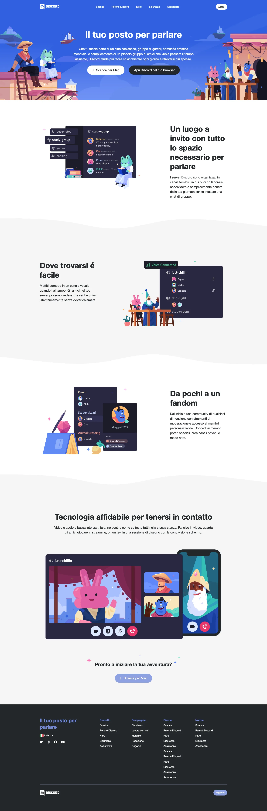

# htmlcss-discord

## 🇬🇧 English Version

### # Overview

Exercise focused on reproducing the Discord layout as faithfully as possible, starting from the structural blocks and then refining each section with real content and styling.

### # Assignment Summary

The exercise required to:

- Create the new project/repository `htmlcss-discord`
- Copy into the new repo only:
  - `index.html`
  - `css/style.css`
  - the `img` folder
- Rebuild the Discord layout based on the provided screenshots, starting from colored blocks and refining section by section
- Identify recurring elements and create reusable CSS classes to keep the code simple, clean and maintainable
- Work only on the desktop layout (no full responsive design required), optionally using relative units where convenient
- Keep the implementation straightforward at first, postponing complex solutions to a later stage

Useful resources:

- Font Awesome CDN and icons: https://cdnjs.com/libraries/font-awesome
- Icon search: https://fontawesome.com/search
- Font stack used: `Whitney, 'Helvetica Neue', Helvetica, Arial, sans-serif`

---

## 🇮🇹 Versione Italiana

### # Panoramica

Esercizio dedicato alla riproduzione del layout di Discord nel modo più fedele possibile, partendo dai blocchi strutturali e passando ai dettagli una sezione alla volta.

### # Riassunto della Consegna

La consegna richiedeva di:

- Creare la nuova cartella/repository `htmlcss-discord`
- Copiare nel nuovo repo solo:
  - `index.html`
  - `css/style.css`
  - la cartella `img`
- Ricostruire il layout di Discord a partire dai blocchi colorati, curando il dettaglio sezione per sezione
- Individuare gli elementi ricorrenti e creare classi CSS riutilizzabili per avere un codice semplice, pulito e facilmente mantenibile
- Lavorare solo sulla versione desktop (senza puntare al responsive completo), usando opzionalmente unità relative dove non complicano il lavoro
- Mantenere l’approccio iniziale semplice, rimandando le soluzioni più complesse a un secondo momento

Risorse utili:

- Font Awesome CDN e icone: https://cdnjs.com/libraries/font-awesome
- Ricerca icone: https://fontawesome.com/search
- Font family da utilizzare: `Whitney, 'Helvetica Neue', Helvetica, Arial, sans-serif`
